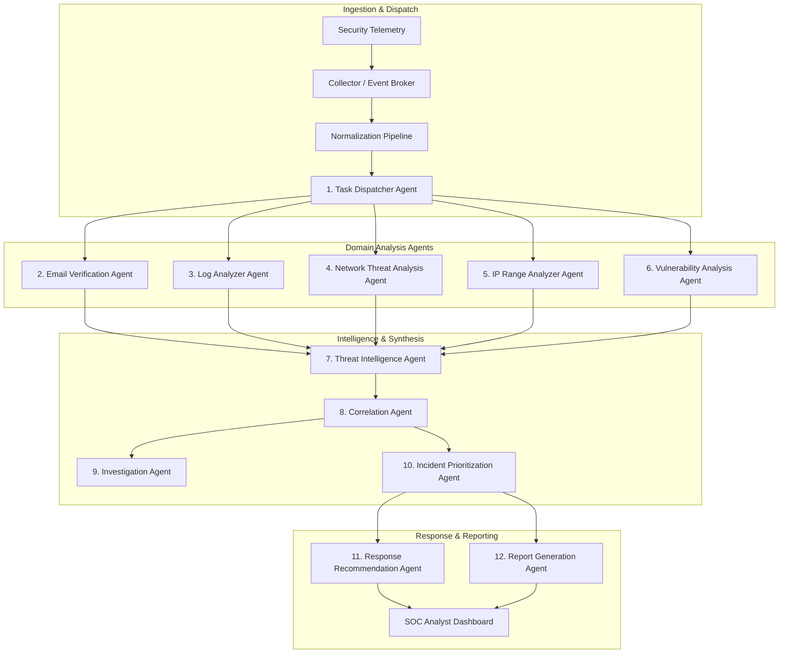

# PROJECT CONSTITUTION & ENGINEERING RULES

**Project Title:** An AI-Driven Multi-Agent System for Real-Time Cybersecurity Threat Detection and Correlation  
**Classification:** Final-Year CSE Major Capstone / Enterprise-Grade SOC Prototype  
**Architecture Paradigm:** Distributed, Event-Driven, Multi-Agent, Multi-Layered Threat Detection & Correlation Platform  
**Target Environments:** Security Operations Center (SOC), Computer Security Incident Response Team (CSIRT), Threat Intelligence Operations  

---

## 1. System Vision, Identity, and Operational Scope

### 1.1 Project Identity
This project is an advanced, production-grade cybersecurity engineering prototype designed to simulate and deliver the operational capabilities of a modern, AI-assisted Next-Generation Security Operations Center (Next-Gen SOC). 

- **NOT a Chatbot:** The platform is not a conversational wrapper around an LLM. It is an automated, continuous security processing engine.
- **NOT a Static Dashboard:** Telemetry, alerts, and incident graphs mutate dynamically in real time via asynchronous event streaming and WebSocket feeds.
- **NOT a Simple Upload-and-Analyze Toy:** The system processes live or replayed high-velocity telemetry streams, performs multi-domain cross-correlation, builds persistent attack graphs, and assists security analysts with evidence-backed recommendations.

### 1.2 Core Objectives
1. **Continuous Ingestion & Telemetry Normalization:** Ingest heterogeneous security events (Syslog, Windows Event Logs, Suricata EVE-JSON, Zeek/Bro, Auth logs, Web access logs, Email MIME, Firewall logs) into a unified schema (ECS / OCSF compliant).
2. **Deterministic & Anomaly Detection:** Run real-time detection rules (Sigma, Suricata, regular expressions) alongside statistical and machine learning anomaly detectors.
3. **Multi-Agent Distributed Intelligence:** Coordinate twelve (12) specialized, autonomous agents to triage, analyze, enrich, prioritize, and correlate threats across disparate security domains.
4. **Grounded Generative AI & Semantic Analysis:** Employ Google Gemini models for deep contextual analysis, attack intent decoding, and explanation generation—constrained strictly to cited facts and retrieved knowledge.
5. **Cross-Domain Correlation & Multi-Stage Attack Tracking:** Reconstruct adversarial kill chains and MITRE ATT&CK techniques by correlating isolated indicators across time, hosts, networks, and identity boundaries.
6. **SOC Analyst Augmentation:** Provide actionable, explainable incident dossiers, defensive playbooks, and automated audit-ready incident reports.
7. **Rigorous Performance & Accuracy Benchmarking:** Measure and report Events Per Second (EPS), end-to-end latency, false positive/negative rates, and agent dispatch efficiency.

---

## 2. Supported Security Domains & Epistemic Rules

### 2.1 Threat Domains
The platform actively detects and correlates threats within the following domains:
1. **Email & Social Engineering:** Phishing, spear-phishing, spoofed headers (SPF/DKIM/DMARC failures), credential harvesting URLs, malicious attachments metadata.
2. **Identity & Authentication:** Brute-force attacks, credential stuffing, password spraying, impossible travel, anomalous privilege escalation, kerberoasting indicators.
3. **Network & Infrastructure:** Port scans, service reconnaissance, SYN floods, DNS tunneling, command-and-control (C2) beacons, DoS/DDoS patterns.
4. **Web & Application Security:** SQL injection (SQLi), Cross-Site Scripting (XSS), Remote/Local File Inclusion (RFI/LFI), Server-Side Request Forgery (SSRF), command injection.
5. **Host & Endpoint Security:** Malware indicators, suspicious LOLBins (Living Off the Land Binaries) execution, unauthorized persistence mechanisms, anomalous process spawning.
6. **Vulnerability & Exposure Management:** Exploitation of known CVEs, unpatched service exposures, misconfigured security headers, weak cryptographic suites.
7. **Advanced Multi-Stage Threats:** Coordinated attacks spanning initial access, discovery, lateral movement, privilege escalation, and exfiltration.

### 2.2 Epistemic Humility & Terminology Standards
The platform must **never** claim omniscience or 100% certainty. All detections, notifications, and AI summaries must utilize calibrated, evidence-grounded language:

| Confidence Level | Permissible Standard Terminology | Required Supporting Evidence |
| :--- | :--- | :--- |
| **Definitive / Deterministic** | `"detected"`, `"confirmed match"`, `"signature trigger"` | Exact rule match (e.g., matching YARA hash, known malicious signature, verified CVE exploit pattern). |
| **Statistical / Heuristic** | `"high-confidence finding"`, `"statistically anomalous"` | Outlier score exceeding 3 standard deviations, validated threshold breach with baseline comparison. |
| **Multi-Source Inferred** | `"correlated attack indicator"`, `"probable multi-stage campaign"` | Temporal or topological link across >= 2 independent data sources sharing entity anchors (e.g., IP, user). |
| **LLM Semantic / Exploratory** | `"possible indicator"`, `"suspicious pattern"`, `"requires analyst verification"` | LLM semantic interpretation of unstructured data, fuzzy similarity, or contextual suspicion. |

---

## 3. Core Multi-Agent Architecture & Agent Responsibilities

The system defines exactly twelve (12) discrete, purpose-built agents. Every agent encapsulates dedicated business logic, state machines, tool sets, and evaluation boundaries.



### 3.1 Agent Inventory & Contracts

1. **Task Dispatcher Agent**
   - *Role:* Ingests normalized security events, inspects event schema and domain tags, and distributes tasks to domain-specific worker queues using priority-weighted dispatch logic.
   - *Boundary:* Does not perform threat detection; manages throughput, agent worker routing, and backpressure.

2. **Email Verification Agent**
   - *Role:* Analyzes email telemetry (MIME structures, headers, authentication results [SPF, DKIM, DMARC], URL reputations, attachment hashes/metadata, body NLP heuristics).
   - *Boundary:* Analyzes email artifacts; never executes attachments or opens untrusted web links.

3. **Log Analyzer Agent**
   - *Role:* Parses, filters, and detects suspicious patterns across system, authentication, web server, database, and application logs using regex, Sigma rules, and frequency baselines.
   - *Boundary:* Scans text/structured logs for indicators of compromise (IoCs) and policy violations.

4. **Network Threat Analysis Agent**
   - *Role:* Inspects flow records (NetFlow/IPFIX), packet capture summaries, Suricata EVE-JSON events, and protocol metadata for anomalous traffic, port scanning, volumetric spikes, and C2 beaconing.
   - *Boundary:* Evaluates network metadata; does not perform active destructive network probing.

5. **IP Range Analyzer Agent**
   - *Role:* Performs passive and authorized active scanning of target subnets, calculates subnet risk scores, analyzes CIDR block reputations, and correlates autonomous system (ASN) metadata.
   - *Boundary:* Restricts active port scans (Nmap) exclusively to explicitly whitelisted, pre-authorized lab/target networks.

6. **Vulnerability Analysis Agent**
   - *Role:* Evaluates asset configuration records, software inventory (CPEs), and open ports against known vulnerability databases (NVD, CVE, CWE, CVSS v3/v4).
   - *Boundary:* Performs passive vulnerability matching and exposure calculation; does not deploy live exploits.

7. **Threat Intelligence Agent**
   - *Role:* Enriches discovered indicators (IPs, domains, hashes, URLs) against local threat intelligence databases, MISP/AlienVault feeds, and a FAISS-backed RAG vector store indexing MITRE ATT&CK techniques and threat actor profiles.
   - *Boundary:* Acts as the external and internal knowledge retrieval gateway for other agents.

8. **Correlation Agent**
   - *Role:* Ingests findings from all domain agents over a sliding temporal window; computes graph-based and rule-based linkages between disparate events; identifies multi-stage kill chains.
   - *Boundary:* Formulates high-level Incidents from clusters of related low-level alerts.

9. **Investigation Agent**
   - *Role:* Functions as an autonomous Tier-2/Tier-3 SOC investigator. Queries historical logs, runs graph traversals across entity links, constructs timeline visualizations, and gathers corroborating evidence.
   - *Boundary:* Compiles investigation dossiers for human review; does not take unilateral operational actions.

10. **Incident Prioritization Agent**
    - *Role:* Computes dynamic Incident Severity Scores (ISS) and Threat Urgency Scores (TUS) by fusing CVSS base scores, asset criticality, threat intelligence confidence, and attack progress.
    - *Boundary:* Assigns triaged priorities (LOW, MEDIUM, HIGH, CRITICAL) to ensure high-risk threats surface immediately.

11. **Response Recommendation Agent**
    - *Role:* Generates targeted, actionable defensive playbooks (e.g., firewall block rules, active directory account locks, endpoint isolation commands, patch advisories) tailored to the specific incident.
    - *Boundary:* Recommends actions with rollback instructions; never executes destructive or configuration-changing actions without explicit human approval (Human-in-the-Loop).

12. **Report Generation Agent**
    - *Role:* Synthesizes the full incident lifecycle, evidence chains, agent reasoning steps, and response outcomes into structured, executive and technical post-incident Markdown/PDF reports.
    - *Boundary:* Produces auditable documentation grounded entirely in recorded system facts.

---

## 4. Multi-Layer Detection Architecture (Defense-in-Depth)

The detection pipeline consists of seven distinct layers. No single layer, particularly the LLM, is permitted to act as an unassisted or sole detection mechanism.

```
+---------------------------------------------------------------+
| Layer 7: Human Analyst Investigation & Verification (HITL)    |
+---------------------------------------------------------------+
                               ^
+---------------------------------------------------------------+
| Layer 6: Cross-Domain Correlation & Kill Chain Tracking       |
+---------------------------------------------------------------+
                               ^
+---------------------------------------------------------------+
| Layer 5: Threat Intelligence & RAG Enrichment (FAISS / MITRE) |
+---------------------------------------------------------------+
                               ^
+---------------------------------------------------------------+
| Layer 4: LLM Semantic Analysis & Intent Decoding (Gemini)     |
+---------------------------------------------------------------+
                               ^
+---------------------------------------------------------------+
| Layer 3: Machine Learning Classification & Clustering         |
+---------------------------------------------------------------+
                               ^
+---------------------------------------------------------------+
| Layer 2: Statistical & Anomaly Detection (Baselines/Z-Scores) |
+---------------------------------------------------------------+
                               ^
+---------------------------------------------------------------+
| Layer 1: Deterministic Rules (Sigma, Suricata, Regex, Yara)   |
+---------------------------------------------------------------+
```

### 4.1 Layer Specifications
- **Layer 1 (Deterministic Rules):** Fast regex parsing, pattern matching, Sigma rule compilation, Suricata alert processing, and static IoC matching. Latency: `< 5ms`.
- **Layer 2 (Statistical/Anomaly Detection):** Rolling time-window aggregations, statistical Z-score/IQR calculation on request rates, baseline deviations on login failure rates. Latency: `< 20ms`.
- **Layer 3 (Machine Learning):** Unsupervised outlier detection (Isolation Forest, One-Class SVM) and supervised classification (Random Forest, XGBoost) on engineered feature vectors. Latency: `< 50ms`.
- **Layer 4 (LLM Semantic Analysis):** Contextual prompt-engineered analysis via Google Gemini API for obfuscated scripts, social engineering subtext, polymorphic log patterns, and attack reasoning.
- **Layer 5 (Threat Intelligence Enrichment):** Vector search over MITRE ATT&CK matrices and CVE repositories using FAISS embeddings, supplemented by hash and IP reputation lookups.
- **Layer 6 (Cross-Domain Correlation):** Temporal graph correlation engine linking entities across layers 1–5 to assemble cohesive Incidents.
- **Layer 7 (Human Analyst Interface):** Real-time interactive investigation, alert confirmation, false-positive tagging, and remediation authorization.

---

## 5. Real-Time Telemetry Pipeline & Event Processing Rules

### 5.1 Architecture Flow
```
Telemetry Source (Logs, PCAP, Auth, Mail)
    │
    ▼
Async Collector / Fast Ingestion API (FastAPI)
    │
    ▼
Event Broker (Kafka / Redpanda / Redis Stream)
    │
    ▼
Normalization Engine (ECS / OCSF Pydantic Models)
    │
    ▼
Task Dispatcher Agent (Routing & Worker Assignment)
    │
    ▼
Parallel Specialized Domain Agents (L1 - L5 Analysis)
    │
    ▼
Correlation Agent (Incident Assembly & Graph Linking)
    │
    ▼
Incident Prioritization & Response Generation
    │
    ▼
Real-Time Alert Dispatch (WebSockets / SSE)
    │
    ▼
SOC Analyst Web Console (React / TypeScript UI)
```

### 5.2 Non-Blocking Processing Mandates
1. **Zero Synchronous Heavy Compute in API Request Path:** The ingestion endpoints must acknowledge event receipt (`202 Accepted`) immediately after pushing raw events to the broker.
2. **Asynchronous Agent Concurrency:** All agent executions, external API calls (Gemini API, Threat Feeds), and heavy database reads/writes must use Python `asyncio` and worker pools (Celery/ARQ/Redis workers).
3. **Graceful Backpressure:** When ingestion throughput exceeds processing capacity, the Event Broker must buffer messages without dropping packets, while monitoring queues emit lag metrics.

---

## 6. Absolute Security & DevSecOps Principles

### 6.1 Zero-Trust Input & Execution Safety
1. **Never Execute Untrusted Payloads:** 
   - Uploaded files, email attachments, scripts embedded in logs, and URLs extracted from payloads must **never** be executed directly in the host OS or container environment.
   - Attachments and binaries may only be statically inspected (metadata extraction, entropy calculation, hash generation, YARA matching).
2. **Strict Network Scanning Boundaries:**
   - Active network scanning via Nmap or custom socket probes is strictly restricted to loopback (`127.0.0.1`), localized private test subnets (RFC 1918), or explicitly configured, containerized mock network ranges.
   - Public Internet scanning is strictly forbidden and blocked by hardcoded boundary assertions.
3. **Defense Against Common Attacks:**
   - **SQL Injection:** Exclusively use parameterized queries via SQLAlchemy 2.0 async ORM. Raw SQL string concatenation is strictly prohibited.
   - **Command Injection:** Never pass user input or telemetry fields to `eval()`, `exec()`, or `shell=True` subprocesses. Use strict argument array execution (`shlex.quote` / subprocess argument lists with explicit binary paths).
   - **Cross-Site Scripting (XSS):** Sanitize and escape all telemetry data displayed in the React frontend.
   - **Path Traversal:** Validate all file paths against strict whitelists; reject paths containing `..`, absolute root specifiers, or null bytes.
   - **Server-Side Request Forgery (SSRF):** Forbid fetching arbitrary URLs supplied in payloads without validation against private IP blocklists.

### 6.2 Secret & Credential Management
1. **Zero Hardcoded Secrets:** Passwords, API keys (including Gemini API keys), tokens, and private certificates must **never** be hardcoded in source code or committed to version control.
2. **Environment Variable Injection:** All sensitive values must be injected via `.env` files managed through Pydantic `BaseSettings`.
3. **Log Sanitization:** Sensitive tokens, credentials, and Authorization headers must be masked (`***REDACTED***`) prior to writing to logs or passing to LLMs.

---

## 7. AI Safety, Grounding, and Anti-Hallucination Standards

### 7.1 LLM Invalidation & Untrusted Status
All outputs generated by Large Language Models (LLMs) are treated as **untrusted AI inferences**. They are never assumed to be infallible ground truth.

### 7.2 Strict Hallucination Prohibitions
The LLM must **never invent or hallucinate**:
- IP addresses, MAC addresses, or domain names
- Timestamps or event chronologies
- User accounts, hostnames, or process trees
- CVE identifiers or CVSS scores
- File hashes or malware classification names
- Attacks or security events not present in the provided context

### 7.3 Mandatory Four-Section Output Schema
Every AI-generated analytical summary or investigation output must strictly categorize information into four clearly demarcated sections:

```markdown
### 1. OBSERVED EVIDENCE
- [EVID-001] 2026-08-31 14:02:11 UTC - Source IP 192.168.1.105 failed authentication 42 times in 60 seconds (Log ID: auth-9821).
- [EVID-002] 2026-08-31 14:03:05 UTC - Successful root login from 192.168.1.105 (Log ID: auth-9865).

### 2. RETRIEVED KNOWLEDGE
- MITRE ATT&CK T1110.001 (Brute Force: Password Guessing) retrieved from local vector store (Similarity: 0.91).
- Internal asset registry classifies host `srv-db-prod01` (192.168.1.105) as Tier-1 Critical Asset.

### 3. AI INFERENCE
- Pattern indicates a probable successful password guessing attack followed by immediate privilege acquisition.
- High risk of unauthorized lateral movement initiation.

### 4. DEFENSIVE RECOMMENDATION
- [REC-001] Isolate host `srv-db-prod01` from the internal management VLAN immediately.
- [REC-002] Invalidate root session token and trigger mandatory password rotation for root and administrative accounts.
```

### 7.4 Reasoning Visibility
- **No Hidden Chain-of-Thought:** Internal scratchpads and raw reasoning tokens must not be exposed to the user interface.
- **Evidence-Based Reasoning Only:** Only concise, step-by-step evidence citations explaining why a conclusion was drawn are exposed to analysts.

---

## 8. Technology Stack & Engineering Principles

### 8.1 Approved Technology Matrix

| Subsystem | Technology | Purpose / Justification |
| :--- | :--- | :--- |
| **Backend Core** | Python 3.11+ / FastAPI | High-performance asynchronous API, native typing, OpenAPI schema generation. |
| **Database & ORM** | PostgreSQL 16+ / SQLAlchemy 2.0 (Async) | Relational integrity, JSONB support for raw events, transactional security. |
| **Data Validation** | Pydantic v2 | High-throughput schema validation, strict typing, settings management. |
| **Event Streaming** | Redis Streams / Kafka / Redpanda | Decoupled, fault-tolerant telemetry ingestion and multi-agent message routing. |
| **Cache & Ephemeral State** | Redis 7+ | Fast rate-limiting, agent state caches, deduplication windows, session storage. |
| **Vector Database / RAG** | FAISS / LangChain / Sentence-Transformers | Fast vector indexing for MITRE ATT&CK, threat actor tactics, and past incident knowledge. |
| **Machine Learning** | Scikit-learn / NumPy / Pandas | Feature extraction, anomaly scoring, clustering, isolation forests. |
| **Generative AI** | Google Gemini API (via official SDK) | Contextual threat reasoning, intent classification, structured report synthesis. |
| **Security Telemetry Engines** | Suricata / Nmap (Sandboxed bindings) | Signature-based network detection and controlled target scanning. |
| **Frontend Framework** | React 18+ / TypeScript / Vite | Type-safe, high-performance, modular UI application. |
| **Styling & Design System** | Tailwind CSS / Lucide Icons | Responsive, modern dark-mode-first SOC interface. |
| **Containerization & CI/CD** | Docker / Docker Compose | Reproducible development, isolated networking, production parity. |

### 8.2 Software Architecture Standards
1. **Modular Code Organization:** Strict separation of concerns (API routes, schemas, core services, domain agents, database models, ML models, RAG vector stores). Files must remain concise, single-responsibility, and cohesive.
2. **Strict Type Annotations:** 100% type hint coverage across Python (`mypy` compliant) and TypeScript (`tsc --strict`).
3. **Dependency Injection:** Use FastAPI's dependency injection system for database sessions, authentication contexts, and agent instances.
4. **Structured JSON Logging:** Use `structlog` or standard Python `logging` with structured JSON formatters to output machine-readable logs containing `trace_id`, `event_id`, `agent_name`, and `latency_ms`.
5. **No Hardcoded Configurations:** All system constants, network limits, batch sizes, and thresholds must originate from typed configuration classes (`config.py`).

---

## 9. System Observability & Performance Metrics

The platform must collect, expose, and display operational metrics for real-time monitoring:

```
+-------------------------------------------------------------------------+
|                         SOC METRICS DASHBOARD                           |
+--------------------------+-----------------------+----------------------+
| Ingestion Rate: 1,250 EPS| E2E Latency: 142ms    | Agent Errors: 0.00%  |
| Queue Backlog: 12 events | LLM Call Latency: 1.1s| Active Incidents: 4  |
+--------------------------+-----------------------+----------------------+
```

### 9.1 Tracked Metric Dimensions
- **Throughput:** Events Per Second (EPS) ingested, normalized, and dispatched.
- **Latency Profile:**
  - Ingestion-to-Broker latency ($T_{\text{ingest}}$)
  - Normalization latency ($T_{\text{norm}}$)
  - Agent task execution duration ($T_{\text{agent\_}i}$)
  - LLM roundtrip response time ($T_{\text{llm}}$)
  - Total End-to-End detection-to-alert latency ($T_{\text{e2e}}$)
- **Queue Health:** Broker message count, worker queue depth, consumer lag.
- **Agent Performance:** Per-agent execution counts, success/failure rates, retry frequency.
- **Security Metrics:** Raw event count, normalized event count, alert generation rate, incident correlation reduction ratio (e.g., $10,000\text{ raw events} \rightarrow 50\text{ alerts} \rightarrow 2\text{ incidents}$).

---

## 10. Auditability, Provenance, & Forensics

Every security decision, alert escalation, and AI-generated conclusion must be completely traceable and reconstructible.

```mermaid
flowchart LR
    Raw[Raw Ingested Event] --> Norm[Normalized Event Record]
    Norm --> AgentExec[Agent Execution Log & Trace ID]
    AgentExec --> Rule[Detection Rule / ML Score]
    Rule --> LLMRAG[LLM Prompt / RAG Source Chunk]
    LLMRAG --> Corr[Correlation Graph Node]
    Corr --> Inc[Incident Record]
    Inc --> Alert[SOC Alert]
    Alert --> Analyst[Analyst Action / Verification Log]
```



### 10.1 Provenance Chain Guarantees
1. **Raw Event Preservation:** Raw telemetry payloads are preserved immutably with SHA-256 integrity hashes.
2. **Trace ID Propagation:** Every incoming event is assigned a unique `trace_id` that is passed through every agent invocation, broker message, database transaction, and log entry.
3. **Execution Traceability:** The system records which exact rule version, ML model artifact, RAG vector document, and LLM prompt/response produced every alert.
4. **Analyst Action Auditing:** Every human analyst interaction (status change, false-positive dismissal, comment, playbook execution) is stored with user ID, timestamp, and rationale.

---

## 11. Phased Development Lifecycle Protocol

To guarantee uncompromising engineering rigor, prevent scope drift, and ensure test-driven quality, development must strictly follow a 10-step protocol per phase.

### 11.1 The 10-Step Phase Discipline
Every project phase must execute the following sequence without deviation:
1. **Inspect Current Code:** Review existing files, dependencies, database models, and test suites.
2. **Implement Requested Phase Only:** Write clean, modular, and typed code strictly scoped to the current phase requirements.
3. **Write Tests:** Author comprehensive unit and integration tests covering positive flows, negative flows, edge cases, and security boundaries.
4. **Run Tests:** Execute test suites (`pytest`, `npm test`, linters) within the environment.
5. **Fix Failures:** Resolve any test failures, linting issues, or regressions immediately.
6. **Update Documentation:** Update architectural diagrams, schemas, API specs, or walkthrough notes.
7. **Report Files Changed:** Provide an explicit inventory of all newly created, modified, or deleted files.
8. **Report Commands Executed:** Detail all shell commands and test runners executed during the phase.
9. **Report Known Limitations:** Explicitly document any deliberate scope exclusions, current mocks, or upcoming dependencies.
10. **STOP:** Conclude the phase output and await user review and approval before advancing.

### 11.2 Anti-Patterns & Prohibitions
- **NO Future Phase Creep:** Do not prematurely implement features or stubs allocated to subsequent phases.
- **NO Fake "Mock Production" Code:** Development mocks and adapters must be cleanly separated and explicitly labelled under `adapters/mock/` or `tests/mocks/`. Real interfaces must define genuine production contracts.

---

## 12. Ratification and Enforcement

This Constitution represents the authoritative architectural and operational baseline for the project **"An AI-Driven Multi-Agent System for Real-Time Cybersecurity Threat Detection and Correlation"**. 

All future development phases, code contributions, refactoring, and agent implementations must strictly conform to the principles, boundaries, and protocols established herein.
