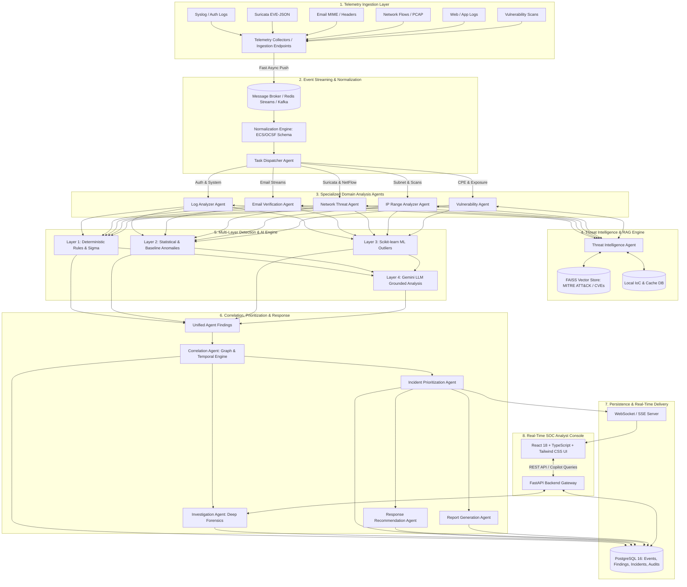
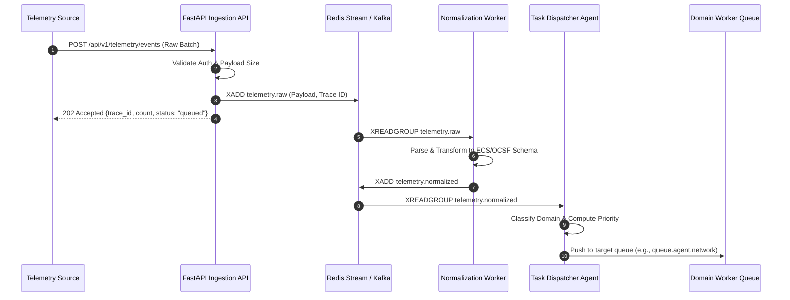
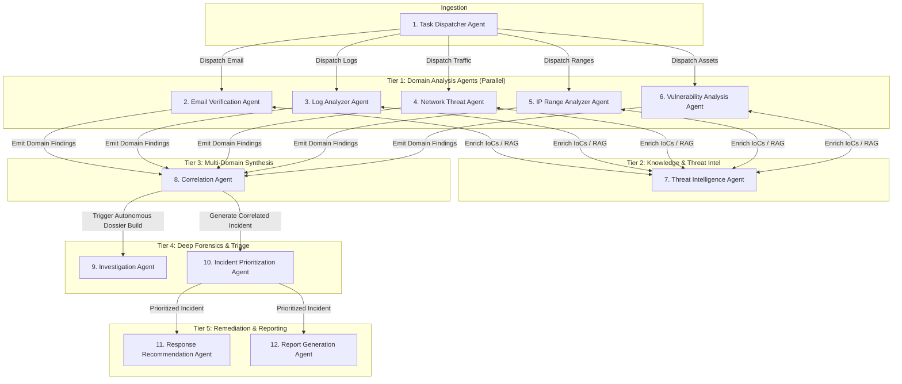
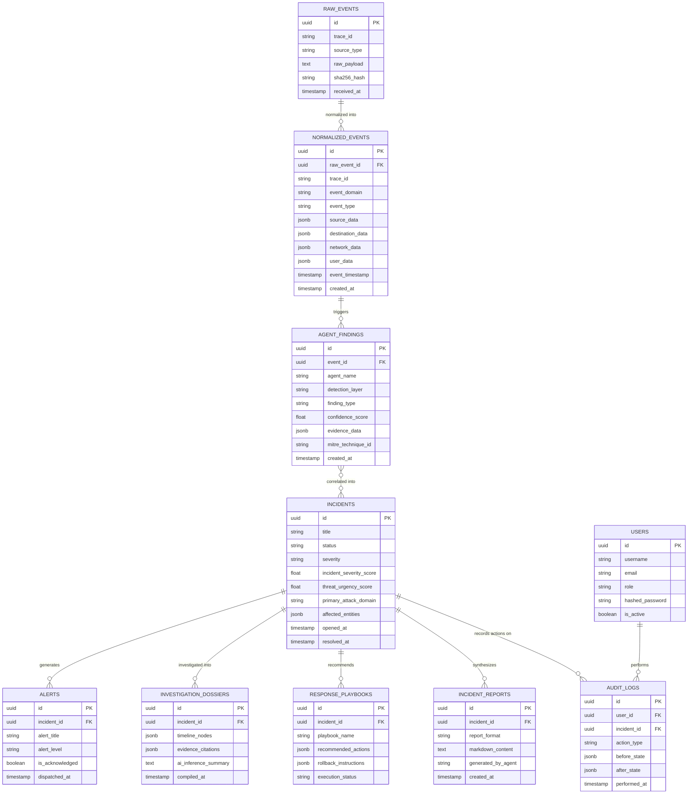
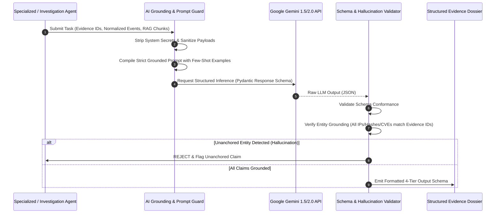
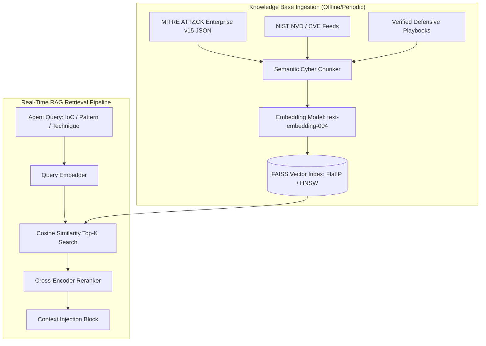
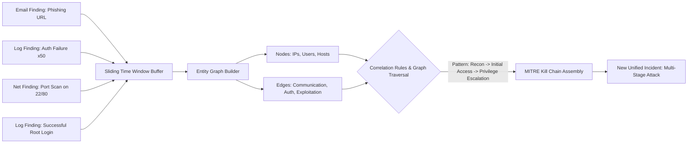
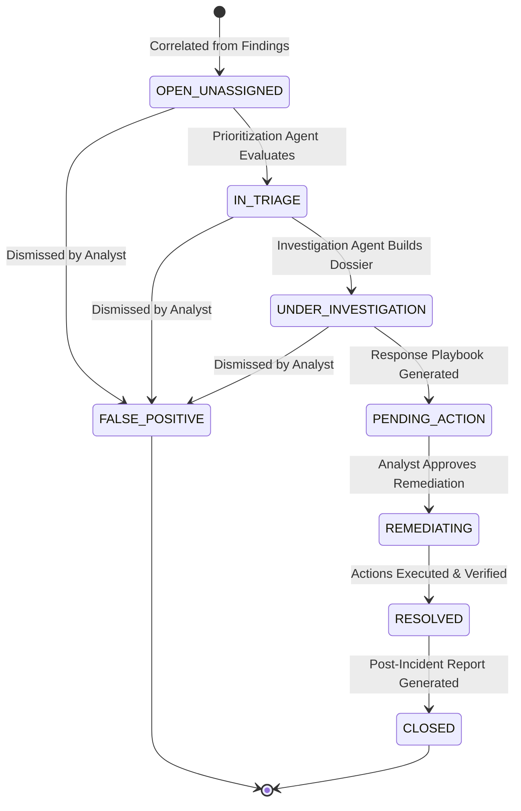
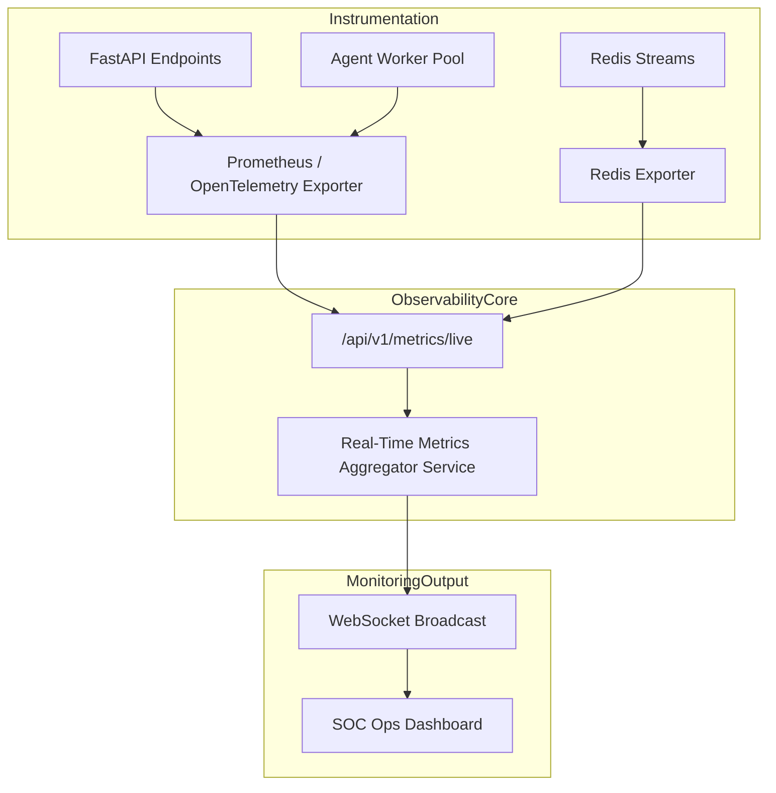

# SYSTEM ARCHITECTURE SPECIFICATION
**Project:** An AI-Driven Multi-Agent System for Real-Time Cybersecurity Threat Detection and Correlation  
**Document Version:** 1.0.0  
**Phase:** Phase 01 — Complete System Architecture  
**Status:** Approved Architectural Baseline  

---

## 1. High-Level System Architecture

The platform is designed as an asynchronous, event-driven, multi-tier distributed system tailored for real-time security telemetry ingestion, multi-layered threat detection, autonomous multi-agent analysis, graph-based cross-domain correlation, and analyst copilot capabilities.

### 1.1 System Architecture Diagram



---

## 2. Real-Time Event Architecture

The event subsystem guarantees sub-second ingestion-to-dispatch latency while providing backpressure protection, message persistence, and fault tolerance.

### 2.1 Event Flow Pipeline



### 2.2 Streaming Topics and Queues

| Stream / Queue Name | Payload Type | Partitioning / Routing Key | Max Retention | Purpose |
| :--- | :--- | :--- | :--- | :--- |
| `telemetry.raw` | `RawEventBatch` | `source_type` | 24 Hours / Ring Buffer | Unmodified raw telemetry ingestion buffer |
| `telemetry.normalized` | `NormalizedEvent` | `event_domain` | 24 Hours | ECS/OCSF compliant structured events |
| `queue.agent.email` | `EmailAnalysisTask` | `recipient_domain` | Ephemeral / In-Memory | Mail analysis tasks |
| `queue.agent.logs` | `LogAnalysisTask` | `host_id` | Ephemeral / In-Memory | Syslog, auth, and web log tasks |
| `queue.agent.network` | `NetworkAnalysisTask` | `src_ip` | Ephemeral / In-Memory | NetFlow, PCAP, and Suricata tasks |
| `queue.agent.ip` | `IPScanTask` | `subnet_cidr` | Ephemeral / In-Memory | IP range risk and scan tasks |
| `queue.agent.vuln` | `VulnAssessmentTask` | `asset_id` | Ephemeral / In-Memory | Vulnerability and CPE match tasks |
| `telemetry.findings` | `AgentFinding` | `correlation_key` | 48 Hours | Detection findings emitted by domain agents |
| `incidents.live` | `IncidentEvent` | `incident_id` | 7 Days | Correlated incident stream for real-time UI |
| `telemetry.dlq` | `FailedMessage` | `origin_queue` | 14 Days | Dead-letter queue for unparseable/failed events |

### 2.3 Normalized Event Schema (ECS / OCSF Hybrid)

```json
{
  "$schema": "https://json-schema.org/draft/2020-12/schema",
  "trace_id": "c6a2b8e4-8841-4d32-901d-5b3cf5429112",
  "event_id": "evt-20260831-9821034",
  "timestamp": "2026-08-31T14:02:11.452100Z",
  "event_domain": "authentication",
  "event_type": "user_login_failed",
  "severity_hint": 3,
  "source": {
    "ip": "192.168.1.105",
    "port": 54210,
    "geo": {"country": "Internal", "asn": "Private"},
    "mac": "00:1A:2B:3C:4D:5E"
  },
  "destination": {
    "ip": "10.0.0.15",
    "port": 22,
    "hostname": "srv-db-prod01",
    "asset_criticality": "TIER_1"
  },
  "user": {
    "name": "root",
    "domain": "CORP",
    "id": "u-0042"
  },
  "network": {
    "protocol": "tcp",
    "transport": "ssh",
    "bytes_in": 1420,
    "bytes_out": 890
  },
  "raw_data_hash": "e3b0c44298fc1c149afbf4c8996fb92427ae41e4649b934ca495991b7852b855",
  "raw_payload_preview": "Aug 31 14:02:11 srv-db-prod01 sshd[4102]: Failed password for root from 192.168.1.105 port 54210 ssh2"
}
```

---

## 3. Multi-Agent Architecture & Inter-Agent Coordination

Each agent is an autonomous state machine conforming to the `BaseAgent` abstract class. Agents do not communicate via uncontrolled peer-to-peer sprawl; instead, coordination occurs via well-defined queues and the centralized **Correlation Engine**.

### 3.1 Agent Interaction Workflow



### 3.2 Agent Detailed Specifications

```
+---------------------------------------------------------------------------------------------------+
| AGENT SPECIFICATION MATRIX                                                                        |
+-----+-----------------------+-----------------------+-----------------------+---------------------+
| #   | Agent Name            | Ingestion Inputs      | Core Processing Engine| Emitted Output      |
+-----+-----------------------+-----------------------+-----------------------+---------------------+
| 1   | Task Dispatcher       | Normalized Events     | Priority Router & LB  | Target Agent Tasks  |
| 2   | Email Verification    | MIME, Headers, EML    | SPF/DKIM, NLP, URLs   | Phishing Findings   |
| 3   | Log Analyzer          | Syslog, Auth, App Logs| Sigma Engine, Regex   | Log Anomaly Findings|
| 4   | Network Threat        | NetFlow, PCAP, EVE    | Flow Baselines, Beacon| Network Findings    |
| 5   | IP Range Analyzer     | CIDR, Scan Requests   | Nmap (Safe), ASN Geo  | Subnet Exposure Info|
| 6   | Vulnerability Analysis| Asset CPEs, Ports     | NVD / CVE / CVSS DB   | Vulnerability Risks |
| 7   | Threat Intelligence   | IoCs, MITRE Queries   | FAISS RAG, Feeds Cache| Enriched Context    |
| 8   | Correlation Agent     | Stream of Findings    | Graph & Temporal Link | Correlated Incidents|
| 9   | Investigation Agent   | Incident IDs, Entities| Deep Trace & Timelines| Investigation Dossier|
| 10  | Incident Prioritizer  | Draft Incidents       | Severity Formula (ISS)| Triaged Severity Rank|
| 11  | Response Recommender  | Prioritized Incidents | Playbook Matcher + AI | Actionable Playbooks|
| 12  | Report Generator      | Incidents + Evidence  | Markdown/PDF Synthesis| Auditable Reports   |
+-----+-----------------------+-----------------------+-----------------------+---------------------+
```

---

## 4. Backend Architecture

The backend is built with Python 3.11+ and FastAPI, adhering to **Clean Architecture** (Hexagonal/Ports & Adapters) principles to isolate domain entities from external libraries, databases, and network transports.

### 4.1 Layered Architecture

```
backend/
├── app/
│   ├── api/                    # Presentation Layer (FastAPI Routers, WebSockets)
│   │   ├── v1/
│   │   │   ├── endpoints/      # Auth, Events, Agents, Incidents, Alerts, Metrics
│   │   │   └── websockets/     # Live Alert & Metric Streams
│   │   └── deps.py             # Dependency Injection Providers
│   ├── core/                   # Core Infrastructure Layer
│   │   ├── config.py           # Typed Settings (Pydantic BaseSettings)
│   │   ├── logging.py          # Structured JSON Logger
│   │   ├── security.py         # JWT, Argon2 Password Hashing, Input Sanitizers
│   │   └── broker.py           # Redis / Kafka Client Manager
│   ├── domain/                 # Pure Business Logic (No frameworks)
│   │   ├── models/             # Domain Entities (Event, Finding, Incident, Alert)
│   │   └── interfaces/         # Repository & Broker Interface Contracts
│   ├── schemas/                # Pydantic v2 DTOs (Request / Response validation)
│   ├── db/                     # Data Access Layer
│   │   ├── session.py          # Async SQLAlchemy Engine & SessionMaker
│   │   ├── base.py             # Declarative Base
│   │   └── repositories/       # Async Repositories (Events, Incidents, Audits)
│   ├── agents/                 # Multi-Agent Implementations
│   │   ├── base.py             # BaseAgent Abstract Class & Lifecycle
│   │   ├── dispatcher.py       # Task Dispatcher Agent
│   │   ├── email_agent.py      # Email Verification Agent
│   │   ├── log_agent.py        # Log Analyzer Agent
│   │   ├── network_agent.py    # Network Threat Agent
│   │   ├── ip_agent.py         # IP Range Analyzer Agent
│   │   ├── vuln_agent.py       # Vulnerability Agent
│   │   ├── intel_agent.py      # Threat Intelligence Agent
│   │   ├── correlation_agent.py# Correlation Engine Agent
│   │   ├── investigation.py    # Investigation Agent
│   │   ├── prioritizer.py      # Incident Prioritization Agent
│   │   ├── recommender.py      # Response Recommendation Agent
│   │   └── reporter.py         # Report Generation Agent
│   ├── detection/              # Detection Engines (L1, L2, L3)
│   │   ├── rules/              # Sigma / Regex Rule Engine (L1)
│   │   ├── anomaly/            # Statistical Baselines & Z-Scores (L2)
│   │   └── ml/                 # Scikit-learn Isolation Forest Models (L3)
│   ├── rag/                    # Retrieval-Augmented Generation Layer
│   │   ├── vector_store.py     # FAISS Index Manager
│   │   ├── embedder.py         # Sentence-Transformers / Gemini Embeddings
│   │   └── knowledge_base.py   # MITRE ATT&CK & CVE Knowledge Graph
│   └── ai/                     # LLM Integration Layer (L4)
│       ├── gemini_client.py    # Google Gemini Async Client
│       ├── prompts/            # Grounded & Schema-Enforced Prompt Templates
│       └── guards.py           # Anti-Hallucination & Output Schema Validators
```

---

## 5. Frontend Architecture

The frontend is a single-page application (SPA) built with React 18, TypeScript, and Tailwind CSS. It is optimized for high-density, low-latency SOC analyst operations.

### 5.1 Frontend Component Hierarchy

```
frontend/
├── src/
│   ├── assets/                 # Icons, Logos, Static Assets
│   ├── components/             # Reusable UI Atoms and Molecules
│   │   ├── common/             # Button, Badge, Modal, Card, Table, Tooltip
│   │   ├── layout/             # TopNavbar, Sidebar, PageContainer, StatusPill
│   │   ├── graphs/             # AttackGraph (ReactFlow/Vis.js), MetricChart
│   │   └── terminal/           # SecurityLogViewer, LiveStreamTerminal
│   ├── features/               # Domain-Driven Feature Modules
│   │   ├── dashboard/          # Real-time Metrics, EPS, Threat Meter, Recent Alerts
│   │   ├── events/             # Ingested Events Table, Search & Filter Bar
│   │   ├── incidents/          # Incident Dossier, Evidence Viewer, Playbook Actions
│   │   ├── investigation/      # Copilot Query Box, Timeline View, Graph Traversal
│   │   ├── intelligence/       # MITRE ATT&CK Matrix Navigator, IoC Lookup
│   │   └── reports/            # Markdown Report Previewer & PDF Export
│   ├── hooks/                  # Custom React Hooks
│   │   ├── useWebSocket.ts     # Resilient Auto-Reconnecting WebSocket Hook
│   │   ├── useIncidents.ts     # TanStack Query Hook for Incident State
│   │   └── useMetrics.ts       # Live Streamed Performance Telemetry
│   ├── services/               # Axios API Clients & WebSocket Connectors
│   │   ├── api.ts              # Central Axios Client with Auth Interceptors
│   │   └── ws.ts               # WebSocket Event Dispatcher
│   ├── state/                  # Global State (Zustand / Context)
│   │   ├── authStore.ts        # Analyst Session & Token Management
│   │   └── alertStore.ts       # Real-Time Incoming Alert Buffer
│   └── types/                  # TypeScript Interface Definitions
│       ├── event.d.ts          # Normalized Event & Raw Event Types
│       ├── incident.d.ts       # Incident, Finding, and Evidence Types
│       └── metrics.d.ts        # Performance & Health Metric Types
```

---

## 6. Database Architecture & Relational ER Model

The data layer uses PostgreSQL 16+ with async connections (`asyncpg` via SQLAlchemy 2.0). Raw event payloads are indexed using JSONB with GIN indexes, while transactional entities enforce strict referential integrity.

### 6.1 Database Entity Relationship (ER) Diagram



---

## 7. AI Architecture & Google Gemini Integration

The AI subsystem leverages Google Gemini models via official SDKs for semantic reasoning, contextual threat intent recognition, and structured report synthesis.

### 7.1 AI Processing Pipeline & Anti-Hallucination Sandbox



### 7.2 Grounded Prompt Template Design
```
You are the AI Reasoning Core for an enterprise SOC.
Analyze ONLY the provided OBSERVED EVIDENCE and RETRIEVED KNOWLEDGE below.

CRITICAL CONSTRAINTS:
1. Do NOT assume, extrapolate, or invent any IP addresses, CVEs, timestamps, or hostnames.
2. Every claim must explicitly cite an Evidence ID [EVID-xxx].
3. You must format your response strictly into the four specified sections.

--- OBSERVED EVIDENCE ---
{evidence_block}

--- RETRIEVED KNOWLEDGE ---
{rag_knowledge_block}

OUTPUT FORMAT:
### 1. OBSERVED EVIDENCE
### 2. RETRIEVED KNOWLEDGE
### 3. AI INFERENCE
### 4. DEFENSIVE RECOMMENDATION
```

---

## 8. RAG (Retrieval-Augmented Generation) Architecture

The RAG subsystem indexes authoritative cybersecurity knowledge bases to supply domain agents and the LLM with grounded tactical context.

### 8.1 RAG Indexing & Retrieval Flow



---

## 9. Threat Intelligence Architecture

The Threat Intelligence Engine unifies local caches, external intelligence feeds, and vector-indexed knowledge.

```
+-------------------------------------------------------------------------------+
|                      THREAT INTELLIGENCE AGENT PIPELINE                       |
+-------------------------------------------------------------------------------+
                                      │
                 Query: Hash / IP / Domain / URL / CVE
                                      │
                                      ▼
                        +----------------------------+
                        |  Local Fast Cache (Redis)   |
                        +----------------------------+
                                      │
                         [Miss]       │       [Hit]
              ┌───────────────────────┴───────────────────────┐
              ▼                                               ▼
+----------------------------+                  +----------------------------+
|  Local Threat Intel Store  |                  | Return Cached Score & TTL  |
|  (STIX/TAXII / MISP Cache) |                  +----------------------------+
+----------------------------+
              │
              ▼
+----------------------------+
|   FAISS MITRE Vector DB    |
| (Technique ID & Tactics)   |
+----------------------------+
              │
              ▼
+-------------------------------------------------------------------------------+
| Consolidated Intel Record: {threat_score, actor, reputation, mitre_tactics}   |
+-------------------------------------------------------------------------------+
```

---

## 10. Correlation Architecture

The Correlation Engine aggregates isolated findings from domain agents over a configurable sliding temporal window (e.g., 10 minutes) and evaluates attack graph topology.

### 10.1 Correlation Pipeline Diagram



### 10.2 Correlation Rules Engine Specifications
1. **Identity & Entity Anchoring:** Link events sharing `source.ip`, `destination.ip`, `user.name`, or `file.sha256`.
2. **Temporal Proximity:** Aggregate events occurring within $\Delta t \le \text{window\_size}$ (default 600s).
3. **Kill Chain Phase Sequencing:** Match sequential progression:
   $$\text{Reconnaissance} \longrightarrow \text{Initial Access} \longrightarrow \text{Execution} \longrightarrow \text{Privilege Escalation} \longrightarrow \text{Exfiltration}$$

---

## 11. Incident Architecture & Prioritization Engine

### 11.1 Incident State Machine Lifecycle



### 11.2 Incident Severity & Urgency Formulas

$$\text{ISS} = \min\left(10.0, \; \left(w_{\text{cvss}} \cdot S_{\text{CVSS}}\right) + \left(w_{\text{asset}} \cdot C_{\text{Asset}}\right) + \left(w_{\text{intel}} \cdot I_{\text{Intel}}\right) + \left(w_{\text{killchain}} \cdot K_{\text{Stage}}\right)\right)$$

Where:
- $S_{\text{CVSS}} \in [0, 10]$: Base vulnerability or threat severity
- $C_{\text{Asset}} \in [1, 10]$: Asset Criticality (Tier 1 = 10, Tier 2 = 7, Tier 3 = 4, Dev = 1)
- $I_{\text{Intel}} \in [0, 10]$: Threat Intelligence Confidence
- $K_{\text{Stage}} \in [1, 10]$: Stage in Kill Chain (Exfiltration = 10, Recon = 2)
- Default Weights: $w_{\text{cvss}} = 0.25, \; w_{\text{asset}} = 0.35, \; w_{\text{intel}} = 0.20, \; w_{\text{killchain}} = 0.20$

---

## 12. Alert Architecture & Real-Time Delivery

### 12.1 Real-Time Broadcast Architecture
1. **Deduplication & Rate Limiting:** High-frequency repetitive findings are collapsed using a sliding 60-second hash bucket to prevent alert fatigue.
2. **WebSocket Channels:**
   - `/ws/v1/alerts/live`: Real-time streaming of prioritized alert notifications.
   - `/ws/v1/metrics/stream`: 1-second interval telemetry throughput and latency metrics.
   - `/ws/v1/incidents/{incident_id}`: Real-time collaborative updates for open incident investigations.

---

## 13. Observability Architecture

### 13.1 Metrics Collection & Telemetry Instrumentation



### 13.2 Tracked Performance KPIs
- **Throughput:** $EPS_{\text{ingest}}$, $EPS_{\text{normalized}}$, $EPS_{\text{dispatched}}$
- **Processing Latency:** $P_{50}$, $P_{95}$, $P_{99}$ latency across all 12 agents
- **LLM Metrics:** Token count per query, response duration, cache hit ratio
- **Conversion Ratios:** Ingested Events $\rightarrow$ Agent Findings $\rightarrow$ Correlated Incidents $\rightarrow$ Actioned Remediations

---

## 14. Security & Isolation Architecture

### 14.1 Zero-Trust Boundaries & Defenses

```
+-------------------------------------------------------------------------------+
|                             SECURITY PERIMETER                                |
+-------------------------------------------------------------------------------+
| 1. API GATEWAY: Rate-limiting (Token Bucket), JWT verification, CORS whitelist|
+-------------------------------------------------------------------------------+
                                      │
                                      ▼
+-------------------------------------------------------------------------------+
| 2. INPUT VALIDATOR: Pydantic v2 strict schemas, payload size caps (< 10MB)    |
+-------------------------------------------------------------------------------+
                                      │
                                      ▼
+-------------------------------------------------------------------------------+
| 3. NON-EXECUTION SANDBOX: Attachments/URLs statically analyzed (No execution) |
+-------------------------------------------------------------------------------+
                                      │
                                      ▼
+-------------------------------------------------------------------------------+
| 4. SCAN BOUNDARY ENFORCER: Nmap restricted to RFC1918 / Loopback whitelists   |
+-------------------------------------------------------------------------------+
                                      │
                                      ▼
+-------------------------------------------------------------------------------+
| 5. AI PROMPT GUARD: Redact secrets, sanitize injection, enforce 4-tier schema |
+-------------------------------------------------------------------------------+
                                      │
                                      ▼
+-------------------------------------------------------------------------------+
| 6. DATABASE ISOLATION: SQLAlchemy 2.0 async parameterized queries (No raw SQL)|
+-------------------------------------------------------------------------------+
```

---

## 15. Deployment & Container Architecture

The system is fully containerized using Docker and orchestrated via Docker Compose for reproducible local development and production-grade staging.

### 15.1 Container Topology

```mermaid
graph TD
    subgraph FrontendContainer["Container: frontend"]
        Nginx[Nginx Reverse Proxy & Static Host (Port 80/443)]
    end

    subgraph BackendContainers["Containers: backend & workers"]
        API[FastAPI Gateway (Port 8000)]
        Worker1[Worker Pool: Dispatcher & Normalization]
        Worker2[Worker Pool: Domain Agents L1-L5]
        Worker3[Worker Pool: Correlation & Investigation Agents]
    end

    subgraph DataContainers["Containers: data & streaming"]
        RedisDB[(Redis 7: Streams & Cache - Port 6379)]
        PostgresDB[(PostgreSQL 16: Database - Port 5432)]
    end

    Nginx -->|Reverse Proxy /api & /ws| API
    API --> RedisDB
    API --> PostgresDB
    Worker1 & Worker2 & Worker3 --> RedisDB
    Worker1 & Worker2 & Worker3 --> PostgresDB
```

---

## 16. Architectural Evaluation & Non-Functional Assessment

### 16.1 Scalability Assessment
- **Horizontal Agent Scaling:** Agent workers consume from partitioned Redis Streams consumer groups, allowing horizontal worker scaling without state contention.
- **Decoupled Ingestion:** Ingestion APIs do not perform computation; they offload raw payloads to Redis Streams in under 5ms, supporting $> 5,000$ EPS per node.

### 16.2 Security Assessment
- **Zero-Execution Guarantee:** Static analysis only; attachments and scripts are never executed.
- **Zero Raw SQL:** 100% ORM parameterization prevents SQL injection.
- **AI Output Enclosure:** Mandatory validation ensures LLM responses cannot inject unanchored data into incident dossiers.

### 16.3 Fault Tolerance Assessment
- **Dead-Letter Queue (DLQ):** Unparseable or crashed event processing attempts are routed to `telemetry.dlq` after 3 retries.
- **Broker Persistence:** Redis Streams AOF (Append-Only File) persistence prevents message loss during unexpected broker restarts.

### 16.4 Testability Assessment
- **Hexagonal Isolation:** Domain logic and agents operate against abstract repository interfaces, allowing full mock-injected unit testing without live databases or brokers.
- **Deterministic Golden Datasets:** Standardized test PCAP, EVE-JSON, and Syslog fixtures allow automated regression verification.

### 16.5 Maintainability Assessment
- **Modular Directory Structure:** Strictly scoped files with single responsibilities.
- **100% Typing:** Comprehensive Python type hints and TypeScript interfaces eliminate dynamic type ambiguities.

---

**END OF ARCHITECTURE SPECIFICATION**
